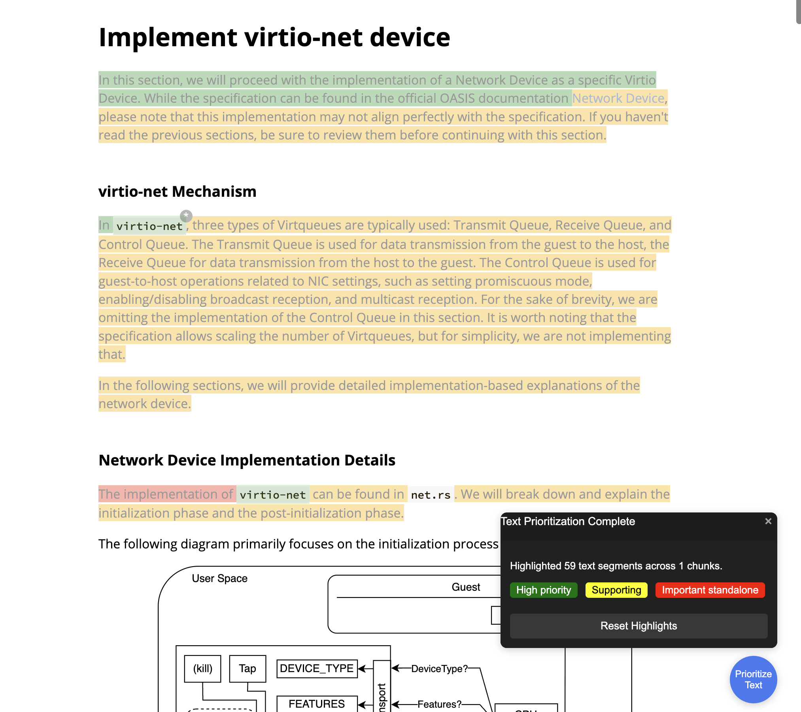
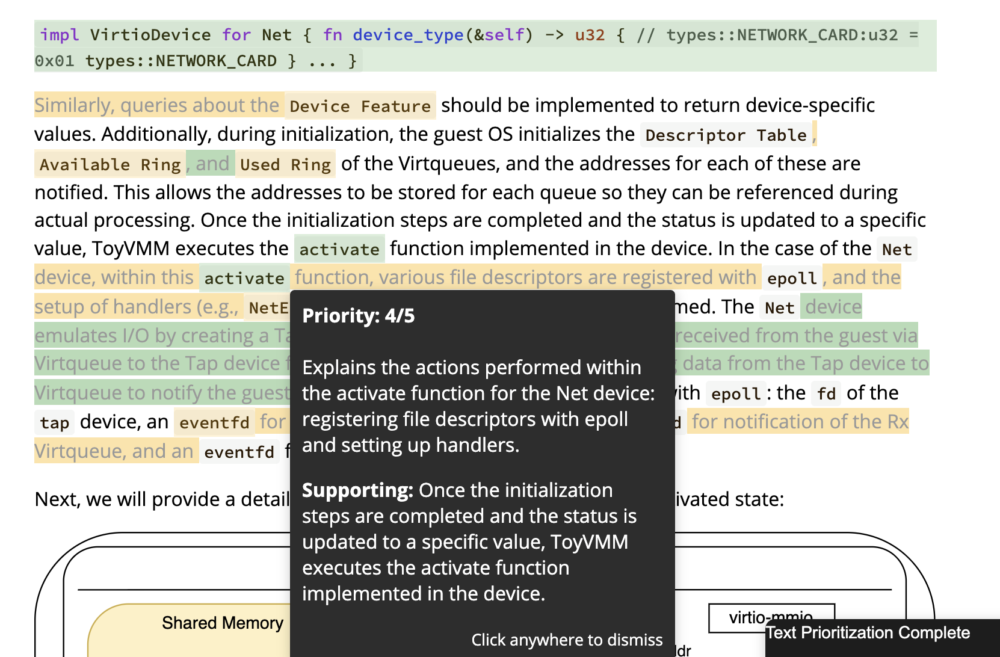

## iQ♭

There is something about summarizing text (sentence or page); even though it gives insight into what the text is about, it looses the spatial representation of the text. In remembering things or deducting the general overview of a text (sentence or phrase), the surrounding text and flow of deduction matters.

This app, provide a means to see the flow of deduction, maintain the spatial representation of texts while presenting the summary and the level of priority. How it does that:

1. identify phrases, sentence and then rank them based on level of importance
2. Identify the most importent text and it supporting text that expresses the fully intent of the most important text
3. Higlight these texts based on their priority color and also attached their summary.

and tooltip displayed for each higlight on click

